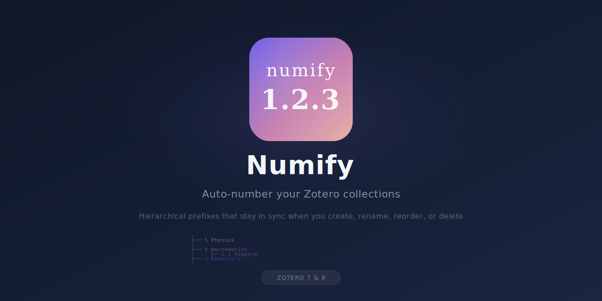
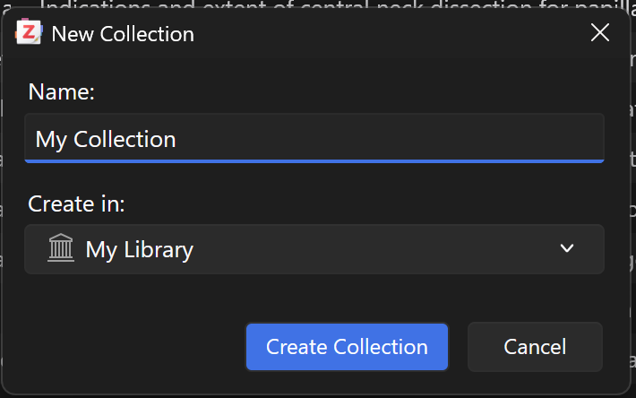
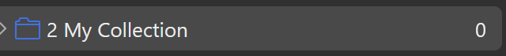
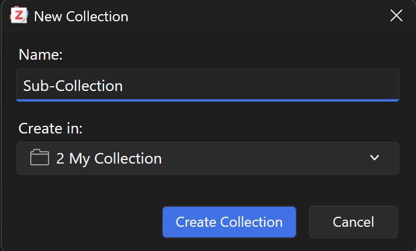
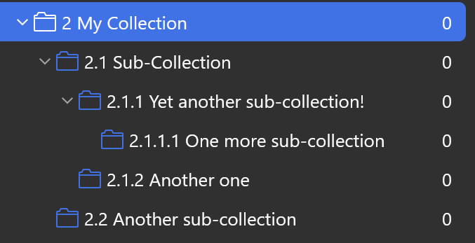
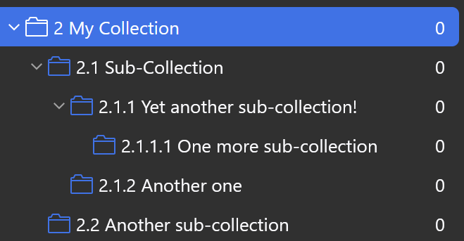
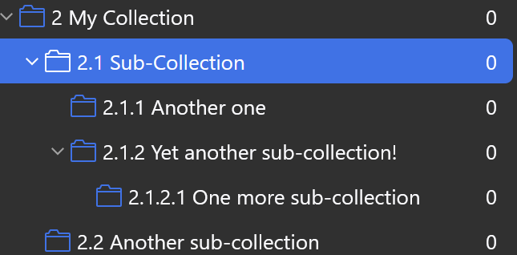
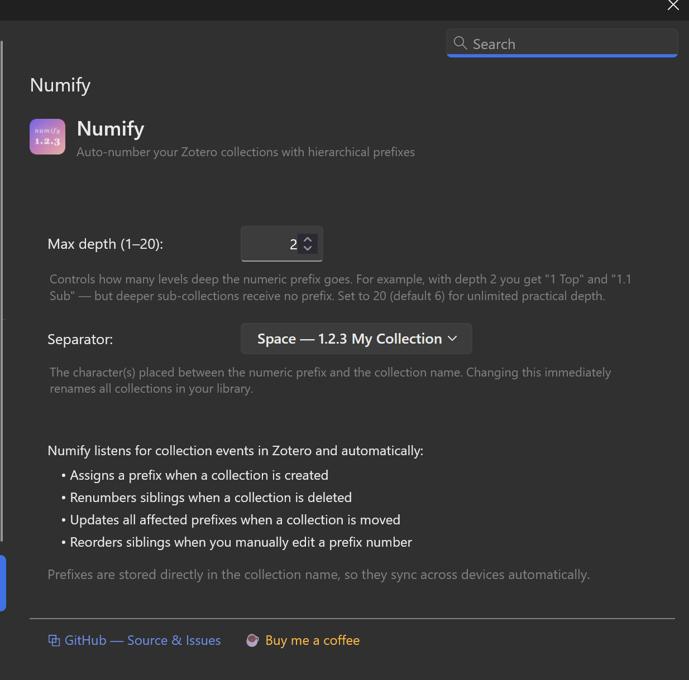

<p align="center">
  
</p>

<p align="center">
  <a href="https://github.com/Rafael-Silva-Oliveira/numify/releases"></a>
  <a href="https://github.com/Rafael-Silva-Oliveira/numify/releases/latest"></a>
  <a href="https://github.com/Rafael-Silva-Oliveira/numify/releases/latest"></a>
</p>
---

Numify automatically adds **hierarchical numeric prefixes** to your Zotero collection names. Create, rename, delete, or reorder collections — the numbering stays in sync.

## Features

- **Auto-prefix on creation** — New collections and sub-collections are instantly numbered
- **Configurable depth** — Set how many levels deep the prefix goes (1–20)
- **Custom separator** — Choose between space or dash (-).
- **Reorder by renaming** — Change a prefix to move a collection to a new position
- **Gap-free numbering** — Deleting a collection renumbers remaining siblings automatically
- **Rename-safe** — Change the base name and your prefix is preserved
- **Syncs across devices** — Prefixes are stored in the collection name, so Zotero syncs them natively
- **Leading zero padding** — Optionally pad top-level prefixes 1–9 as 01–09 for correct alphabetical sorting (useful for Zotero Android)


## Future releases
- **More sorting strings** - Different methods to sort collections (A.B.C.D, a.b.c.d, I.II.III.IV, i.ii.iii.iv, etc)

```
Library
├── 1 Physics
│   ├── 1.1 Quantum Mechanics
│   │   ├── 1.1.1 Entanglement
│   │   └── 1.1.2 Superposition
│   └── 1.2 Classical Mechanics
├── 2 Mathematics
│   ├── 2.1 Algebra
│   └── 2.2 Calculus
└── 3 Chemistry
```

## Requirements

- **Zotero 7.0 or later** — Download from [zotero.org](https://www.zotero.org/download/)

## Installation

1. Download the latest `numify.xpi` from the [Releases](https://github.com/Rafael-Silva-Oliveira/numify/releases/latest) page

2. Open Zotero and go to **Tools > Add-ons**

3. Click the **gear icon** (⚙) in the top-right corner and select **Install Add-on From File...**

4. Browse to the downloaded `numify.xpi` file and click **Open**. Also available on the Zotero Add-ons market (https://github.com/syt2/zotero-addons)

5. Restart Zotero if prompted

> **Building from source** (optional):
> ```bash
> git clone https://github.com/Rafael-Silva-Oliveira/numify.git
> cd numify
> npm install
> npm run build
> ```
> The built `.xpi` will be at `.scaffold/build/numify.xpi`

## Usage

**Note**: If you are using an external storage other than Zoteros default, I recommend using [ZotMoov](https://github.com/wileyyugioh/zotmoov) to sync your collections across devices.

### Creating collections

When you create a new collection, Numify automatically assigns the next available prefix.

1. Create a new collection in your library — Numify adds the prefix automatically

   

2. The collection appears with its hierarchical prefix

   

### Creating sub-collections

Sub-collections receive prefixes relative to their parent.

1. Right-click a collection and create a new sub-collection

   

2. The full hierarchy is numbered automatically — sub-collections, sub-sub-collections, and beyond

   

### Reordering collections

Since Zotero doesn't support drag-and-drop reordering between collections (only to another collection), Numify lets you **reorder by editing the prefix**.

For example, to move `2.1.2 Another one` to position 1:

1. Starting from this hierarchy:

   

2. Rename `2.1.2 Another one` to `2.1.1 Another one`

3. **Collapse and re-expand the parent collection** (in this case `2.1 Sub-Collection`) for the order to refresh

4. Numify detects the position change and shifts the other collections accordingly — `Another one` is now `2.1.1` and `Yet another sub-collection!` shifted to `2.1.2`

   

> **Tip:** After changing a prefix, simply collapse and re-open the parent collection in the sidebar to see the updated order.

## Settings

To access Numify's settings, go to **Edit → Settings → Numify** (or **Zotero → Settings → Numify** on macOS).



### Max depth (1–20)

Controls how many levels deep the numeric prefix goes. For example:

| Max depth | Example result |
|-----------|---------------|
| 1 | `1 Physics`, `2 Math` — sub-collections have no prefix |
| 2 | `1 Physics`, `1.1 Quantum` — deeper levels have no prefix |
| 6 | `1.2.3.4.5.6 Deep` — default, covers most use cases |

Collections beyond the configured depth keep only their base name with no prefix. Changing this setting immediately renumbers all collections in your library.

### Separator

The character placed between the numeric prefix and the collection name. Choose from:

| Option | Example |
|--------|---------|
| Space (default) | `1.2.3 My Collection` |
| Dash | `1.2.3 - My Collection` |

Changing the separator immediately renames all collections in your library to use the new format.

### Leading zero

When enabled, top-level prefixes 1–9 are padded to 01–09. This ensures collections sort correctly in apps that use alphabetical ordering, such as Zotero for Android. Sub-collections use unpadded numbering (1.1, 1.2.3, etc.).

| Setting       | Top-level     | Sub-collection |
|---------------|---------------|----------------|
| Off (default) | `1 Physics`   | `1.1 Quantum`  |
| On            | `01 Physics`  | `1.1 Quantum`  |


## How it works

Numify uses Zotero's [Notifier API](https://www.zotero.org/support/dev/client_coding/javascript_api) to listen for collection events:

| Event | What happens |
|-------|-------------|
| **Create** | New collection is assigned the next prefix; all siblings are renumbered |
| **Rename** | Base name change → prefix is reapplied. Prefix change → siblings are reordered |
| **Delete / Trash** | Remaining siblings are renumbered to close gaps |
| **Move** | Both old and new parent's children are renumbered |

All renaming is done with `skipNotifier: true` to prevent infinite loops. An in-memory cache tracks parent IDs and names to detect moves vs. reorder intents.

## Development

```bash
# Start dev mode with hot-reload
npm start
```

This watches for changes and auto-reloads the plugin in Zotero.

## License

[MIT](LICENSE)
